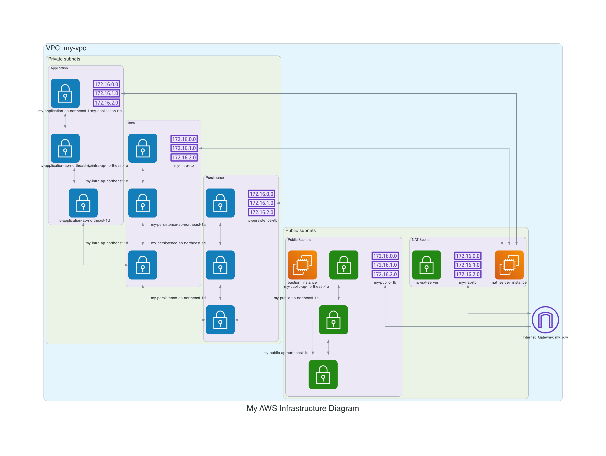

# Best Practice for using Terraform to Create AWS Infrastructure
## Create resources about VPC, Subnets, Internet Gateway, Network ACLs, Route Tables and Instances (Bastion Server and NAT Server)



* Region: `ap-northeast-1` (Tokyo)
* VPC: `my-vpc`
* Public subnets: associated route table directs the subnet's traffic to the Amazon VPC's IGW.
    * Public: `my-public-ap-northeast-1` with zones a, c and d
    * NAT Server: `my-nat-server` with zone c
* Private subnets: associated route table directs the subnet's traffic to the NAT Server.
    * Application: `my-application-ap-northeast-1` with zones a, c and d
    * Intra: `my-intra-ap-northeast-1` with zones a, c and d
    * Persistence: `my-persistence-ap-northeast-1` with zones a, c and d
* Internet Gateway: `my-igw`
* Route Tables:
    * Public: `my_public_rtb` directs the subnet's traffic to the Amazon VPC's IGW.
    * NAT Server: `my_nat_server_rtb` directs the subnet's traffic to the Amazon VPC's IGW.
    * Applicaion: `my_application_rtb` directs the subnet's traffic to the NAT Server.
    * Intra: `my_intra_rtb` directs the subnet's traffic to the NAT Server.
    * Persistence: `my_persistence_rtb` directs the subnet's traffic to the NAT Server.
* Instances:
    * Bastion Server: `my_bastion_instance` with my-public-ap-northeast-1a subnet
    * NAT Server with `my_nat_server_instance` with my_nat_serversubnet

## Create all resources and review all changes
* Run the following commands:
```
cd terraform-aws-infra
terraform plan -out .plan --var-file example.tfvars -lock=true -refresh=true
```

## Apply all changes
* Run the following commands:
```
terraform apply ".plan"
```

## Destroy all changes
* Run the following commands:
```
terraform destroy --var-file example.tfvars
```